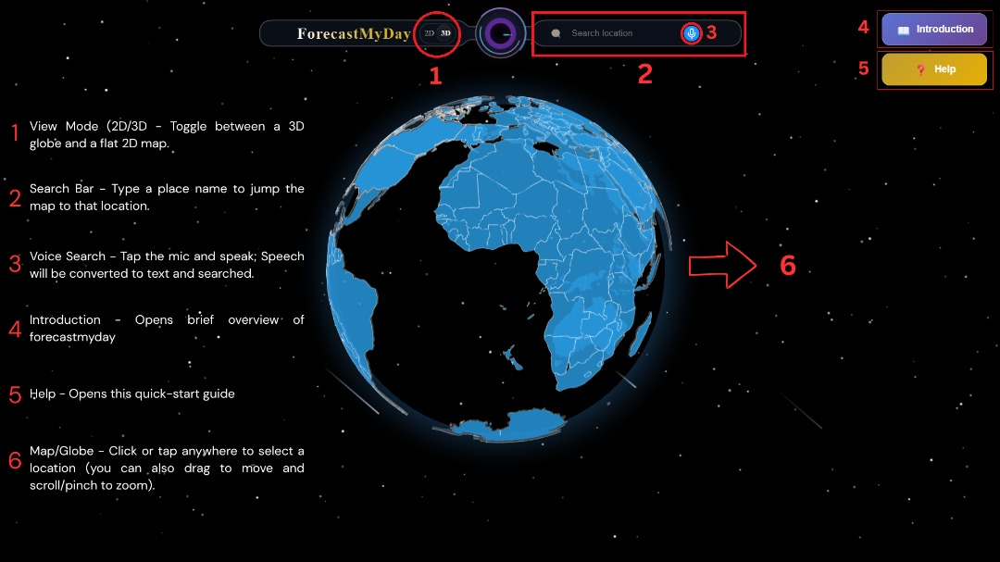
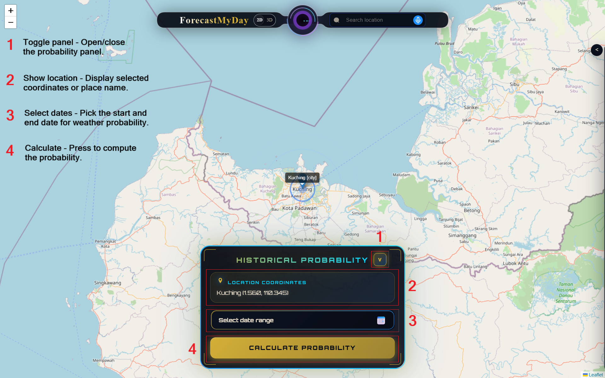
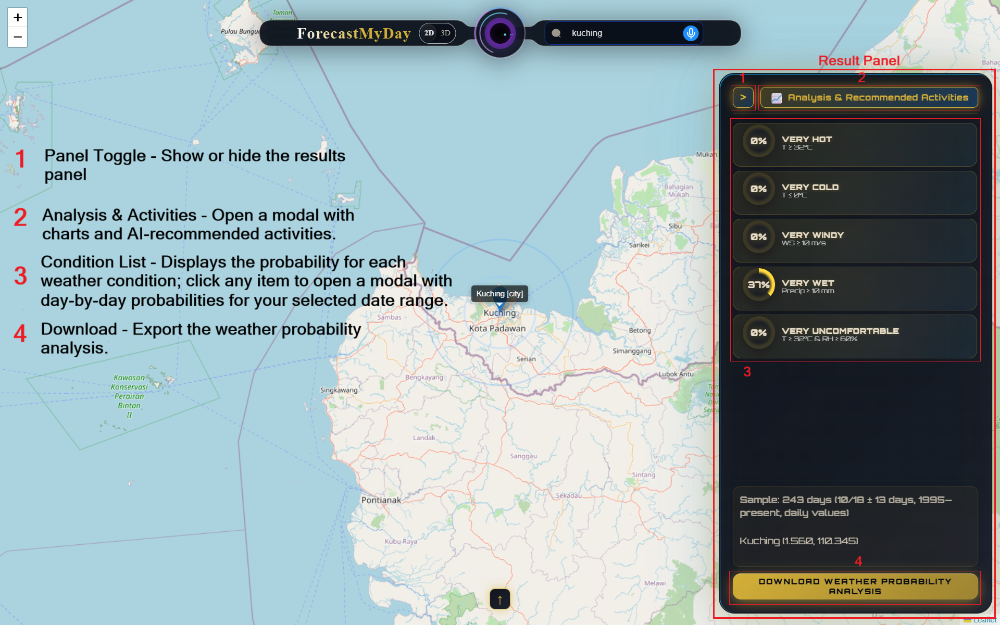
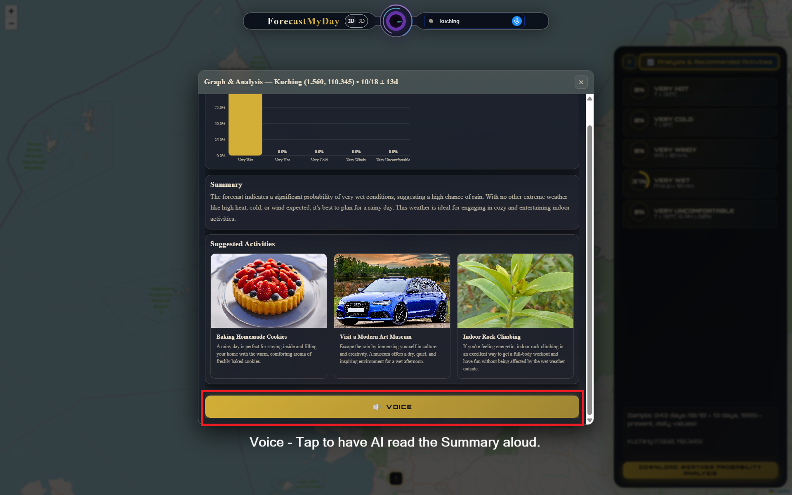
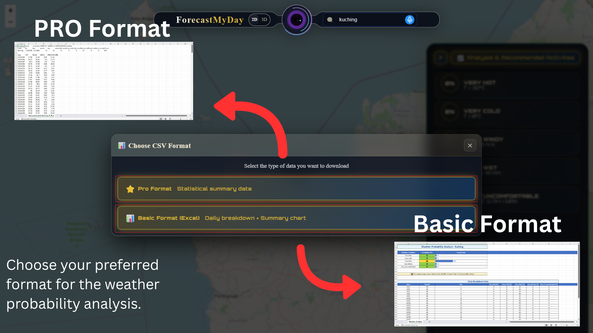

# 🌍 ForecastMyDay

> **Plan months ahead with NASA-powered climate intelligence**

Turn a decade of NASA POWER data into simple, location-specific weather probabilities. Perfect for travelers, event organizers, and field teams who need to plan months in advance.

[](https://forecastmyday.vip)
[](https://www.youtube.com/)

---

## 📖 Overview

**ForecastMyDay** transforms 10 years of NASA POWER historical data into clear, actionable weather probabilities for any location and date range. Unlike short-term forecasts (7-14 days), we analyze historical patterns to help you plan **months ahead** with confidence.

### 🎯 Key Features

- **🌐 Interactive Globe & Map** - Pick locations via 3D globe, 2D map, voice search, or text input
- **📊 Weather Probabilities** - Calculate odds for Very Hot, Very Cold, Very Windy, Very Wet, and Very Uncomfortable conditions
- **🤖 AI-Powered Insights** - Get plain-language summaries and personalized activity recommendations from Gemini 2.5 Pro
- **📈 Visual Analytics** - Clean graphs showing day-by-day probability breakdowns
- **🔊 Voice Playback** - Listen to AI-generated summaries hands-free
- **📥 Export Options** - Download Basic (Excel with charts) or Pro (statistical CSV) formats
- **🗣️ Voice Search** - Speak your destination and fly there instantly

---

## 🚀 Live Demo

**Web App**: [https://forecastmyday.vip](https://forecastmyday.vip)  
**Video Demo**: [YouTube](https://www.youtube.com/)

---

## 🎬 How It Works

### 1️⃣ **Select Location**



- Switch between **3D Globe** and **2D Map** views
- **Search by name** or use **Voice Search** to speak your destination
- Click/tap directly on the map to select any location
- Access **Introduction** and **Help** guides anytime

---

### 2️⃣ **Choose Date Range**



- Select your target date window (e.g., "March 15-25")
- View selected location (name or coordinates)
- Click **Calculate Probability** to analyze 10 years of NASA data
- Results appear instantly in the side panel

---

### 3️⃣ **Review Results**



- View probability cards for each weather condition
- Click any card for **day-by-day breakdown**
- Open **Analysis & Recommended Activities** for AI insights
- **Download** analysis in Basic or Pro format

---

### 4️⃣ **AI Analysis & Activities**



- **Bar chart** showing probability distribution
- **Plain-English summary** of weather patterns
- **3 Activity Suggestions** with photos and descriptions
- **Voice playback** for hands-free listening

---

### 5️⃣ **Export Data**



- **Basic Format (Excel)**: Human-readable with summary charts
- **Pro Format (CSV)**: Statistical data for advanced analysis

---

## 📊 Weather Standards (Thresholds)

| Condition | Threshold |
|-----------|-----------|
| 🌡️ **Very Hot** | T ≥ 32°C |
| ❄️ **Very Cold** | T ≤ 0°C |
| 💨 **Very Windy** | Wind Speed ≥ 10 m/s |
| 🌧️ **Very Wet** | Precipitation ≥ 10 mm/day |
| 😰 **Very Uncomfortable** | T ≥ 32°C & Humidity ≥ 60% |

---

## 🛠️ Technology Stack

### **Frontend**
- **Framework**: React.js (v19.1.1)
- **3D Visualization**: react-globe.gl, Three.js, @react-three/fiber
- **Mapping**: Leaflet, react-leaflet, D3-geo
- **UI Components**: Material-UI (@mui/material)
- **Styling**: Emotion (@emotion/react, @emotion/styled)

### **AI & Data**
- **AI Model**: Google Gemini 2.5 Pro (@google/generative-ai)
- **Data Source**: NASA POWER API
- **Export**: ExcelJS (Excel generation)

### **Development & Deployment**
- **IDE**: Visual Studio Code
- **Version Control**: GitHub
- **Hosting**: Vercel
- **Domain**: GoDaddy
- **Languages**: JavaScript, HTML, CSS, TypeScript

---

## 📦 Installation

### Prerequisites
- Node.js (v16 or higher)
- npm or yarn

### Setup

```bash
# Clone the repository
git clone https://github.com/yourusername/ForecastMyDay.git
cd ForecastMyDay

# Install dependencies
npm install

# Create .env file for API keys
echo "REACT_APP_GEMINI_API_KEY=your_gemini_api_key" > .env

# Start development server
npm start
```

The app will open at `http://localhost:3000`

---

## 🔧 Configuration

### Environment Variables

Create a `.env` file in the root directory:

```env
REACT_APP_GEMINI_API_KEY=your_gemini_api_key_here
REACT_APP_NASA_POWER_API=https://power.larc.nasa.gov/api/temporal/daily/point
```

### API Keys

- **Gemini API**: Get your key from [Google AI Studio](https://makersuite.google.com/app/apikey)
- **NASA POWER**: Free, no key required

---

## 📱 Usage

### Basic Workflow

1. **Open the app** → See the 3D globe
2. **Select location** → Click, search, or speak
3. **Choose dates** → Pick your travel/event window
4. **Calculate** → Get instant probability analysis
5. **Review** → Check day-by-day breakdowns
6. **Get AI insights** → View recommendations and activities
7. **Export** → Download for offline use

### Voice Search

1. Click the **🎤 microphone icon**
2. Say your destination (e.g., "Tokyo, Japan")
3. The globe flies to your location automatically

### Export Formats

- **Basic (Excel)**: Summary + charts + daily breakdown
- **Pro (CSV)**: Raw statistical data for analysis

---

## 🎯 Use Cases

### 👥 **Travelers**
- Plan trips months in advance
- Avoid extreme weather conditions
- Get activity recommendations based on climate

### 🎪 **Event Organizers**
- Choose optimal dates for outdoor events
- Assess weather risks for conferences/festivals
- Plan backup dates with better probabilities

### 🔬 **Research Teams**
- Schedule field work during favorable conditions
- Analyze historical climate patterns
- Export data for scientific analysis

---

## 🚧 Future Roadmap

- [ ] **Multi-location comparison** - Compare weather probabilities side-by-side
- [ ] **Confidence intervals** - Show uncertainty ranges for each probability
- [ ] **Date optimization** - AI suggests alternative dates with better weather
- [ ] **Team workspaces** - Shared scenarios, notes, and reports
- [ ] **Custom thresholds** - Define your own weather criteria
- [ ] **Mobile app** - React Native version for iOS/Android
- [ ] **Calendar export** - Add weather insights to Google/Apple Calendar
- [ ] **User feedback loop** - Improve AI recommendations based on usage

---

## 👥 Team Members

- **Patrick Tai**
- **Wong Neng Horng**
- **Goh Sin Hua**
- **Kho Chi Ning**
- **Brendon Wong**
- **Ngu Kie Gui**

---

## 🙏 Acknowledgments

- **NASA POWER** - For providing free, high-quality climate data
- **Google Gemini** - For AI-powered insights and recommendations
- **React Community** - For amazing open-source tools and libraries

---

## 📧 Contact

- **Website**: [https://forecastmyday.vip](https://forecastmyday.vip)
- **Email**: support@forecastmyday.vip

---

<div align="center">
  <strong>Made with ❤️ by the ForecastMyDay Team</strong>
  <br>
  <sub>Powered by NASA POWER & Google Gemini</sub>
</div>
